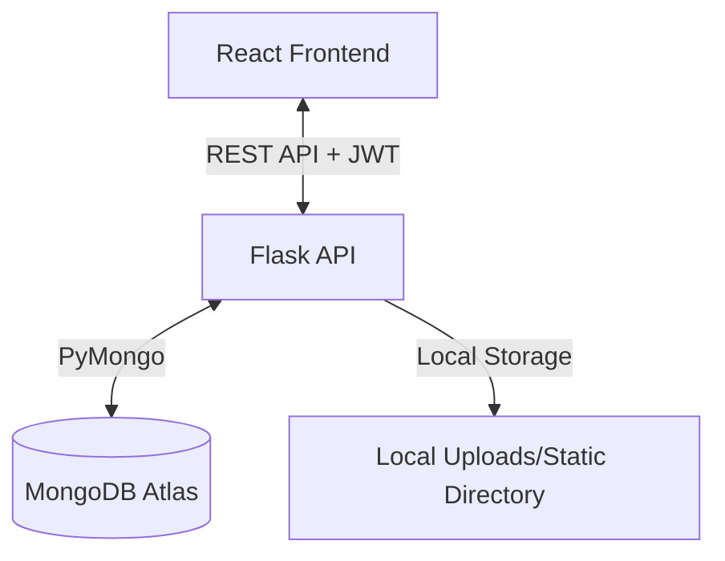

# Implementation Plan - Modern Construction Company Website

We will build a high-end, responsive, and mobile-first website for a premium construction company. The architecture will separate the frontend (React + Vite) and the backend (Flask REST API + MongoDB).

## Architecture Overview



## Folder Structure

We will structure the project into two main directories: `frontend` and `backend`.

```text
/
├── backend/
│   ├── app.py                 # Flask entrypoint
│   ├── config.py              # Configuration & Environment
│   ├── database.py            # MongoDB Client & Connection
│   ├── auth.py                # JWT & Authentication Helpers
│   ├── requirements.txt       # Backend Python dependencies
│   ├── uploads/               # Project images directory (git ignored)
│   └── routes/
│       ├── __init__.py
│       ├── projects.py        # Project CRUD operations
│       ├── inquiries.py       # Contact Inquiries CRUD
│       ├── settings.py        # Site Settings CRUD
│       └── auth.py            # Admin Auth login/verification
│
├── frontend/
│   ├── package.json
│   ├── vite.config.js
│   ├── tailwind.config.js
│   ├── postcss.config.js
│   ├── index.html
│   └── src/
│       ├── main.jsx
│       ├── App.jsx
│       ├── index.css          # Tailwind and Font imports
│       ├── components/
│       │   ├── Navbar.jsx
│       │   ├── Footer.jsx
│       │   ├── FloatingButtons.jsx
│       │   ├── ProjectCard.jsx
│       │   ├── Lightbox.jsx
│       │   ├── ProtectedRoute.jsx
│       │   └── UI/ (Button, Input, TextArea, Spinner)
│       ├── pages/
│       │   ├── Home.jsx
│       │   ├── Works.jsx
│       │   ├── ProjectDetails.jsx
│       │   ├── About.jsx
│       │   ├── Contact.jsx
│       │   ├── AdminLogin.jsx
│       │   └── AdminDashboard.jsx
│       ├── context/
│       │   └── AuthContext.jsx
│       └── services/
│           └── api.js         # Axios instances and configuration
```

## Database Schema (MongoDB Collections)

### 1. `admins`
Used for JWT admin authentication.
```json
{
  "_id": "ObjectId",
  "username": "admin",
  "password_hash": "string (hashed with bcrypt)"
}
```

### 2. `projects`
Stores construction projects.
```json
{
  "_id": "ObjectId",
  "title": "string",
  "description": "string",
  "location": "string",
  "year": "integer",
  "thumbnail": "string (URL or path)",
  "gallery": ["string (URL or path)"],
  "createdAt": "date"
}
```

### 3. `site_settings`
Single document storing global editable content.
```json
{
  "_id": "ObjectId",
  "company_name": "string",
  "hero_title": "string",
  "hero_subtitle": "string",
  "about_text": "string",
  "phone": "string",
  "email": "string",
  "whatsapp": "string",
  "address": "string"
}
```

### 4. `contacts`
Stores user contact inquiries.
```json
{
  "_id": "ObjectId",
  "name": "string",
  "phone": "string",
  "email": "string",
  "message": "string",
  "created_at": "date",
  "status": "string ('pending' or 'contacted')"
}
```

## Implementation Phases

1. **Backend Setup**:
   - Write `requirements.txt`.
   - Setup MongoDB connection in `database.py`.
   - Create models and routes.
   - Implement JWT authentication with default admin creator.
   - Implement file upload functionality.
2. **Frontend Setup**:
   - Initialize Vite React project.
   - Set up Tailwind CSS (v3) & Poppins font.
   - Build UI components & Page layouts.
   - Integrate Axios and state management.
3. **Database Initialization**:
   - Provide a seeding script `seed.py` for default admin and site settings.
4. **Validation & Testing**:
   - Test forms, admin dashboards, image uploads, and routing.
5. **Deployment Guide**:
   - Create deployment documentation for MongoDB Atlas, Render (Backend), and Vercel (Frontend).
